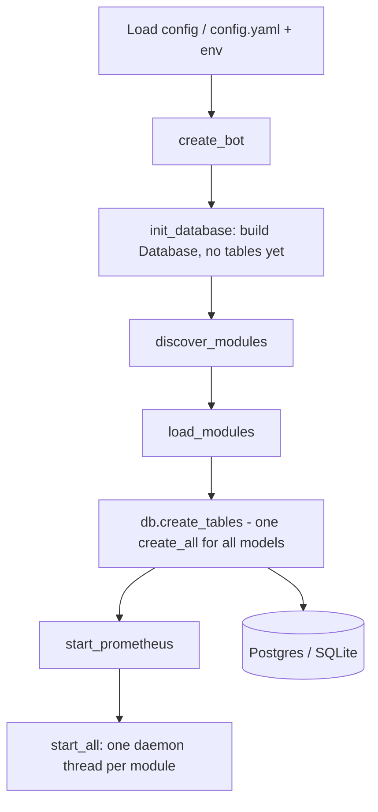

# Database Layer Architecture

## Overview

The bot persists data through a small **ORM-only** database layer built on SQLAlchemy, backed by Postgres in production and SQLite for tests and demos. The layer exists to give every module a simple, safe, and collision-free way to persist its state without touching core code: modules define SQLAlchemy models that are discovered automatically, and their tables are created in a **single `create_all` pass once every module is loaded**.

The layer makes three deliberate trade-offs:

- **ORM-first, always.** No dataframes, no raw-dict bulk inserts, no SQL string building in modules. All persistence goes through ORM models and sessions.
- **One shared metadata.** Every model — core and module-defined alike — lives on the same declarative `Base.metadata`, so one `create_all` covers the whole schema.
- **`create_all` as the MVP schema strategy.** Tables are created (not migrated); schema evolution is out of scope for now (see *Future work*).

## Components

| Component | Where | Role |
|---|---|---|
| `Database` | `status_bot/database.py` | Wraps the engine and session factory. ORM-only surface: `session()`, `create_tables(tables=None)`, `execute(sql)`, `close()`. Supports `postgres` and `sqlite` URL schemes. |
| `Base` | `status_bot/models/base.py` | SQLAlchemy `DeclarativeBase`. The single registry every model registers on. |
| `namespace(prefix)` | `status_bot/models/base.py` | Decorator that renames a model's table to `{prefix}_{name}` so module tables can't collide with core tables. Rejects empty prefixes, idempotent. |
| `model_by_table(name)` | `status_bot/models/base.py` | Scans `Base.registry.mappers` at call time and returns the mapped class for a table name, or `None`. Dynamic, so it sees late-registered and namespaced models. |
| Core models | `status_bot/models/` | `ReceivedMessage`, `ReceivedChat`, `Community`, `Channel`. |
| `ModuleContext.db` | `status_bot/modules/base.py` | How a module receives the shared `Database` instance — or `None` when no database is configured. |

All of `Base`, `namespace`, `model_by_table`, and `Database` are re-exported from the top-level `status_bot` package for a single import point.

## Startup flow (two-phase table initialization)

Tables must be created *after* module models exist. The flow in `main.py` is therefore:



```text
1. init_database()   # engine + session factory, tables NOT created yet
2. discover_modules()# importing module files registers their models on Base.metadata
3. load_modules()    # instantiate modules (each receives ModuleContext.db)
4. db.create_tables()# create_all now covers core + module tables
5. start_all()       # modules run as daemon threads
```

This is what makes the design work: a model defined at module level in any module file is simply present on `Base.metadata` by the time `create_tables()` runs. No core edits are needed to add a table.

## The dynamic model registry

Model lookups are not cached in a frozen import-time map (a fixed dict built at package import would never see models registered later). Instead, `model_by_table()` walks `Base.registry.mappers` on each call and matches on `mapper.local_table.name`. Consequences:

- Late-registered models are always discoverable.
- Namespaced names (`mymodule_visit`) resolve correctly.
- Unknown names resolve to `None`, which callers treat as "no model for this table".

## Namespacing module tables

Modules avoid table collisions by prefixing their model:

```python
from status_bot import Base, namespace

@namespace("mymodule")
class Visit(Base):
    __tablename__ = "visit"   # physically "mymodule_visit"
```

The decorator renames `__tablename__` and `__table__.name` after class creation; the model stays on the shared `Base.metadata`, so the single `create_all` still covers it. Because a module file is imported during `discover_modules()`, module-level model definitions are registered automatically.

## Writing and reading data

`Database` never exchanges dataframes — modules build ORM objects and commit through short-lived sessions:

```python
with self.ctx.db.session() as session:
    session.add_all(rows)
    session.commit()

with self.ctx.db.session() as session:
    rows = session.execute(select(Visit)).scalars().all()
```

Built-in modules follow the same contract: `receiver` converts raw event dicts directly into `ReceivedMessage`/`ReceivedChat` instances and writes them in one batch; `communities_monitoring` uses `session.merge()` for primary-key upserts. Since `self.ctx.db` may be `None`, modules always guard before touching the database.

## Thread model

Each module runs in its own daemon thread via the `ModuleManager`. The layer provides a session factory but no shared session, which is deliberate: SQLAlchemy sessions are not thread-safe, so modules are expected to open a fresh session per operation, and never share one across threads. The single shared object is the engine, which is thread-safe.

## Future work

- **Versioned migrations (Alembic).** `create_all` handles green-field schema only. Once the schema is established in production, adding/altering columns needs real migrations.
