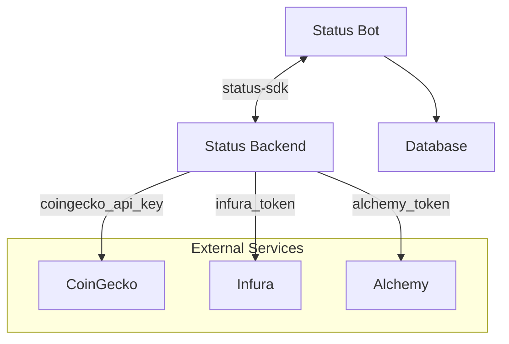

# Status Bot

The Status Bot is a Python tool communicating with [`status-im/status-go`](https://github.com/status-im/status-go) and [`status-im/status-python-sdk`](https://github.com/status-im/status-python-sdk) to automate some actions.

## Architecture



Status-Backend use external services:

- **CoinGecko** - Optional to get token price
- **EVM access** - Required to interract with Token Gated community. Only Infura EVM works.
- **Alchemy** - Optional to get account transactions 

## Account Setup

The Bot require a Status Account to work.

### Intializing new account

The account can be initialized at startup with the following configuration:

```yaml
bot:
    password: 'Gonster2026!'
    mnemonic_phrase: "ETH seed phrase"
    chat_key: 'zQ3..Example'
    name: 'Display Name'
    infura_token: 'Your Infura token'
    coingecko_api_key: 'Your Coingecko API key'
    alchemy_token: 'Your Alchemy token'
```

Existing `.bkp` files can be imported in the docker container under `/backups`. The full configuration explaination can be found in the [configuration](deployment/configuration.md) page.
