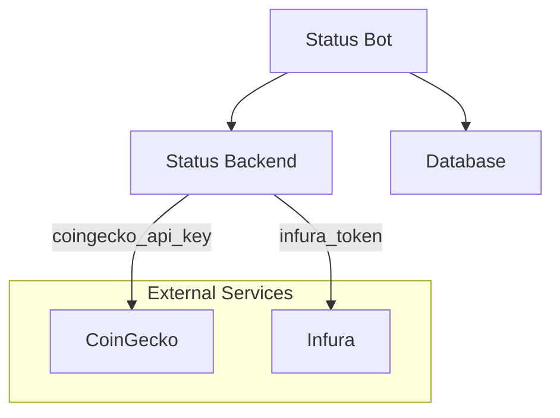

# Status Bot

The Status Bot is a Python tool communicating with the Status-backend to automate some actions.

## Architecture



The Status Bot use [status-python-sdk](https://github.com/status-im/status-python-sdk) for the interraction with Status Backend.

The Status-Backend use external services:

* CoinGecko - Optional to get token price
* EVM access - (Infura for example) required to interract with Token Gated community.

## Account Setup

The Bot require a Status Account to work.

### Intializing new account

The account can be initialized at startup with the following configuration:

```yaml
bot:
  init_account: true
  display_name: 'status-bot'
  password: 'ChangeMeIfYouCare'
  mnemonic_phrase: 'twelve characters list ...'
  compressed_key: 'compressed-key'
```

### Importing Status Account

The account can also be imported from the Status Application.
It first need to export a backup, then import it in the docker container under `/backups`.

> Note: the account backup need to also be imported in Status Backend

The full configuration explaination can be found in the [configuration](deployment/configuration.md) page.
