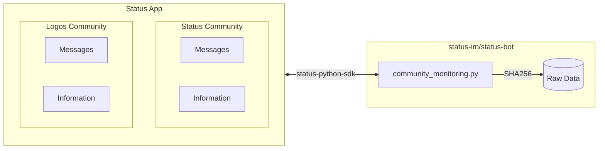

# Community Monitoring

Community admins already have a dashboard in the Status App for tracking overall message volume and membership. This module goes further by storing community information and messages so that more advanced, non-intrusive analytics can be produced. The diagram below shows how the Status and Logos communities are monitored:

**Token gated chats have an impact on the entire community.** You must provide an Infura Token, Coingecko and Alchemy API keys during login. If wallet credentials are left out, then the community will not be visible.

Analytics that can be made from the raw data:

- Total community members over time.
- Overall, bridged and native (within Status App) community usage.
- Daily active members
- Historical messages per channel
- Historical messages and unique senders
- Toxic classification

## Messages

Each message retrieved from a community is stored as a row in the `raw_messages` table. The columns are described below. The **Hashed** column marks fields that are passed through SHA256 before being inserted into Postgres.

| Column | Data Type | Description | Hashed | Optional |
| --- | --- | --- | --- | --- |
| `id` | Text | Unique message identifier. | ✅ | - |
| `whisper_timestamp` | Timestamp | Time the message was propagated on the transport layer. | - | - |
| `from` | Text | Public key of the message sender. | ✅ | - |
| `seen` | Boolean | Whether the message has been marked as seen. | - | - |
| `chat_id` | Text | Identifier of the channel/chat the message belongs to. | - | - |
| `community_id` | Text | Identifier of the community the message belongs to. | - | - |
| `message_type` | Integer | Numeric code for the message type (e.g. plain text, reply, system message). | - | - |
| `response_to` | Text | `id` of the message this one replies to, if any. | ✅ | - |
| `timestamp` | Timestamp | Sender-reported time the message was created. | - | - |
| `deleted` | Boolean | Whether the message was deleted by the sender or a moderator. | - | - |
| `extracted_timestamp` | Timestamp | Time the bot fetched the message from the community. | - | - |
| `toxicity` | Float | Toxicity score from the classification model. | - | ✅ |
| `severe_toxicity` | Float | Severe toxicity score from the classification model. | - | ✅ |
| `obscene` | Float | Obscenity score from the classification model. | - | ✅ |
| `threat` | Float | Threat score from the classification model. | - | ✅ |
| `insult` | Float | Insult score from the classification model. | - | ✅ |
| `identity_attack` | Float | Identity attack score from the classification model. | - | ✅ |
| `source` | Text | Origin of the message (e.g. native Status App or a bridged network). | - | - |
| `batch_timestamp` | Timestamp | Time the ingestion batch that included this message was run. | - | - |

### Detoxify

[Detoxify](https://github.com/unitaryai/detoxify) is an open-source Python library used to predict toxic comments and classify text toxicity using deep learning. `detoxify` installs the CPU build of PyTorch by default. For faster inference on a CUDA GPU, uninstall `torch` and `torchvision`, then reinstall the GPU builds by following the instructions on PyTorch's website. When running the module, the script will automatically check if CUDA is available. If `detoxify` is not set up or disabled from `config.yaml`, the **optional columns** will not be populated.

### Upcoming

- Opt out users from monitoring if they request.
