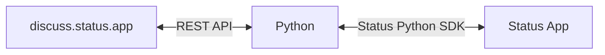
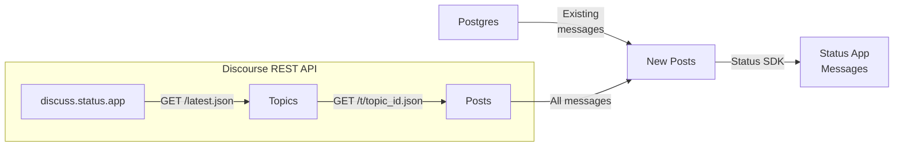
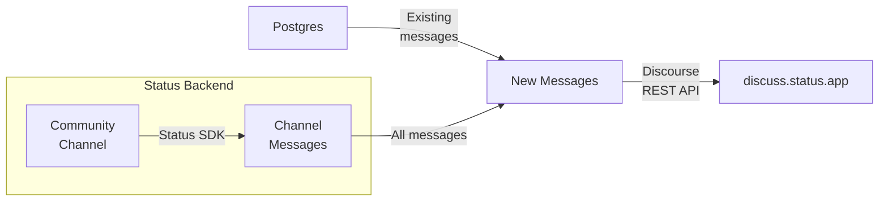

# Status App x Discourse bridge

[Matterbridge](https://github.com/42wim/matterbridge) is a chat bridge that keeps different chat networks in sync, relaying messages across platforms such as Discord, WhatsApp, Telegram, Signal and MS Teams. The Status team maintains a [`matterbridge` fork](https://github.com/status-im/matterbridge) that adds Status App as a supported platform. Building on this, a custom bridge connects the [discuss.status.app](https://discuss.status.app/latest) forum with Status App through the Status Python SDK, helping drive community growth and engagement.

Each section below describes how messages are kept up to date.

## Internal State

A Postgres table is used to map every Discourse post and topic IDs to the Status App's message and chat IDs. **All the fields are public**.

| Column          | Data Type | Description                                                                                     |
|-----------------|-----------|-------------------------------------------------------------------------------------------------|
| `id`            | Text      | Unique ID of the post. This column is composed of `topic_id` and `post_id`.                     |
| `topic_id`      | Integer   | The Topic ID as it is in Discourse.                                                             |
| `post_id`       | Integer   | The Post ID in the current `topic_id` as it is in Discourse.                                    |
| `post_number`   | Integer   | The post number in the current `topic_id` as it is in Discourse.                                |
| `reply_to`      | Text      | The reply `id`.                                                                                 |
| `user_id`       | Integer   | The user's ID as it is in Disciourse.                                                           |
| `username`      | Text      | The user's username as it is in Discourse                                                       |
| `markdown_text` | Text      | The user's text from Discourse / Status App. Discourse text is converted from HTML to markdown. |
| `image_url`     | Text      | Discourse image URL of `username`.                                                              |
| `post_url`      | Text      | Discourse URL of the current `topic_id` and `post_number`.                                      |
| `created_at`    | Timestamp | When the message was created in Discourse / Status App.                                         |
| `updated_at`    | Timestamp | When the message was updated in Discourse / Status App.                                         |
| `slug`          | Text      | Discourse `topic_id` human readable slug.                                                       |
| `message_id`    | Text      | Message ID from Status App                                                                      |
| `chat_id`       | Text      | Chat ID from Status App                                                                         |
| `source`        | Text      | If the message was sent from `status` or `discourse`                                            |
| `is_open`       | Boolean   | If users can send messages in the topic.                                                        |

## Workflow

The bridge currently operates on Status App Community Channels. Support for [Threads](https://github.com/status-im/status-app/pull/21351) is planned for [Status App 2.40](https://github.com/status-im/status-app/issues/21910).

**The account that runs the bridge must have admin privileges in the Community**. When a Discourse Topic is archived or closed, the bridge automatically grants `view` permissions on the corresponding Channel; those permissions are revoked once the Topic becomes active again.

### To Status App

**Notes**:
- Messages that are longer than the current Status App limit are broken down into sub messages. Each sub message is stored in Postgres.
- Forwarded posts appear as regular messages from the bot account in Status App. [Bridge support will be added soon](https://github.com/status-im/status-go/issues/7774). This feature will automatically be picked up by `CommunitiesMonitoring`.
- Discourse REST API uses only `GET` requests and works without any tokens.

### To Discourse

**Notes**:

- The bridge will upload Status App text messages only. Image support will be added in the future. When a message has an unsupported content type, the bot replies with an automated message.
- Status App messages that have an emoji, specified from `config.yaml`, indicate that the message was successfully posted on the Discourse topic. All available Status App emojis can be found in the [docs](https://github.com/status-im/status-python-sdk/blob/master/docs/utils.md#emojis).
- Discourse REST API uses `POST` and requires a config `key` and `username`. If not provided, messages will not be sent to Discourse.
- Between every posted message, there must be a `delay` so all messages are posted successfully.

## Upcoming

- **Message Rate Limit** - prevent spamming the Discourse channel with too many messages
- **Image support** - add image support in Discourse upload and Status App forwarding.
- **Threads** - replace Community Channels with Channel Threads.
