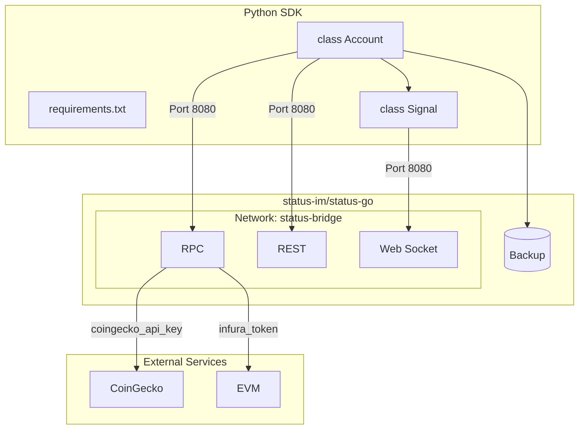
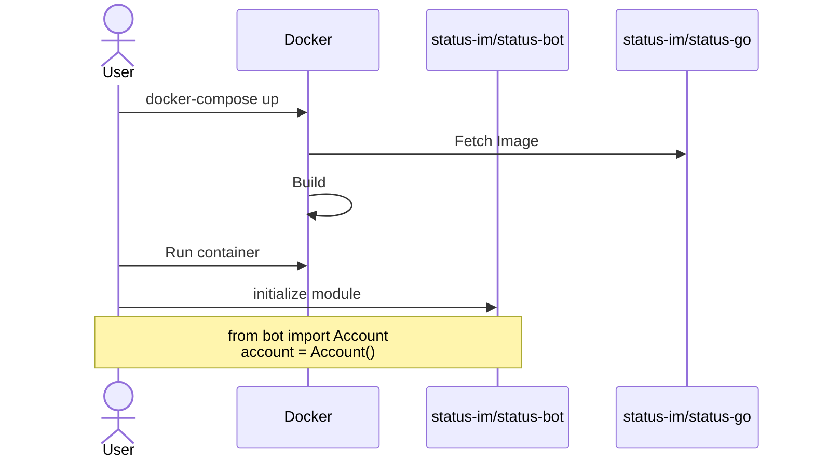

# Status Python SDK

The initial Python Status Backend was built with testing in mind, instead of easy developer access. The objective of this repository is to make a SDK that is:

- **light** - as less external packages when it comes to working with Status App
- **fast** - quick to get started with Status Python
- **documented** - clear explanations of what was done and **why it was done in a specific way**.

Currently this repository is not on [PyPi](https://pypi.org/) but will be added when core functionality has been devleoped and tested.

## How it works

## Setup

To access Python funcitonality you will have to set up [Status Backend](https://github.com/status-im/status-go/). Easiest and fastest way to get it running would be with [Docker](https://www.docker.com/products/docker-desktop/).

