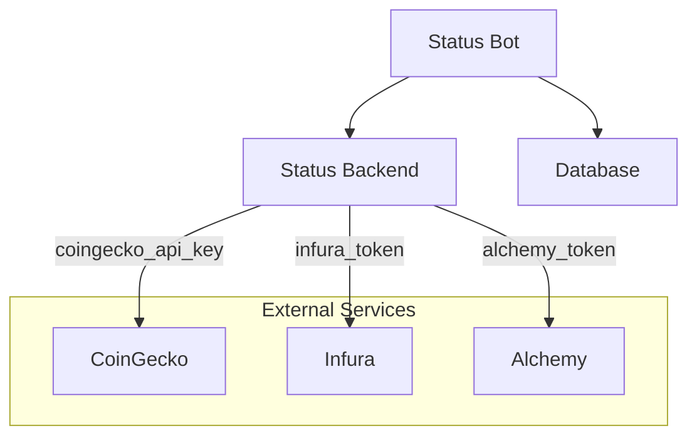

# Status Bot

The Status Bot is a Python tool communicating with the Status-backend to automate some actions.

## Architecture


```mermaid
graph TB

   BACKEND[Status Backend]
   BOT[Status Bot]
   DB[Database]
   subgraph external[External Services]
        COINGECKO[CoinGecko]
        INFURA[Infura]
        ALCHEMY[Alchemy]
    end

   BOT --> BACKEND
   BACKEND --> |coingecko_api_key| COINGECKO
   BACKEND --> |infura_token| INFURA
   BACKEND --> |alchemy_token| ALCHEMY
   BOT --> DB
```

The Status Bot use [status-python-sdk](https://github.com/status-im/status-python-sdk) for the interraction with Status Backend.

The Status-Backend use external services:
* CoinGecko - Optional to get token price
* EVM access - Infura required to interract with Token Gated community.
* Alchemy - working with account transactions

## Account Setup

The Bot require a Status Account to work.

### Intializing account

Under the hood, `status-sdk` will check if the account already exists in Status Backend. The account can be initialized at startup with the following configuration:

```yaml
bot:
  name: 'status-bot'
  password: 'ChangeMeIfYouCare'
  mnemonic_phrase: '12 / 18 / 24 word list ...'
  chat_key: 'zQ3..Example'
```

**Note**: To have access to previous data, make sure you have the account's `.bkp` file.
