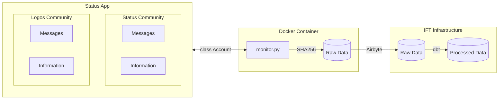

# Community Monitoring

The Status Bot can be used to monitore activity in community

## Fetch Data

 **No personal data is collected from users.**

| Field                 | Hashed   | Description                                                 |
|:----------------------|:---------|:------------------------------------------------------------|
| **id**                | **Yes**  | The message's ID                                            |
| **whisper_timestamp** | No       | The whisper timestamp of the message                        |
| **from**              | **Yes**  | The public key of the user                                  |
| **message_type**      | No       | The message type                                            |
| **seen**              | No       | True if the message has been seen otherwise False           |
| **chat_id**           | No       | The chat ID is a combination of community ID and channel ID |
| **community_id**      | No       | The ID of the community                                     |
| **response_to**       | **Yes**  | Ithe public key of the user who the response is for         |
| **timestamp**         | No       | The timestamp of the message                                |
| **deleted**           | No       | True if the message was deleted otherwise False             |

Status Bot account information can be found in [`config.yaml`](./config.yaml).

## How it works

