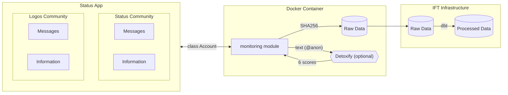

# Community Monitoring

The Status Bot can be used to monitore activity in community

## Fetch Data

 **No personal data is collected from users.**


| Field                 | Hashed   | Description                                                 |
|:----------------------|:---------|:------------------------------------------------------------|
| **id**                | **Yes**  | The message's ID                                            |
| **whisper_timestamp** | No       | The whisper timestamp of the message                        |
| **from**              | **Yes**  | The public key of the user                                  |
| **message_type**      | No       | The message type                                            |
| **seen**              | No       | True if the message has been seen otherwise False           |
| **chat_id**           | No       | The chat ID is a combination of community ID and channel ID |
| **community_id**      | No       | The ID of the community                                     |
| **response_to**       | **Yes**  | The public key of the user who the response is for          |
| **timestamp**         | No       | The timestamp of the message                                |
| **deleted**           | No       | True if the message was deleted otherwise False             |
| **source**            | No       | `status`, or the bridge name for bridged messages           |

Six additional columns are appended when [toxicity classification](#toxicity-classification) is enabled. Status Bot account information can be found in [`config.yaml`](./config.yaml).

### Toxicity Classification

The monitoring module can optionally score each message with [Detoxify](https://github.com/unitaryai/detoxify) - the `original` model, trained on the Jigsaw Toxic Comment Classification dataset. This is **off by default** and requires the extra dependency group:

```bash
pip install -e ".[monitoring]"
```

Enable it in `config.yaml`:

```yaml
modules:
    enabled: ["monitoring"]
    settings:
        monitoring:
            detoxify: true
            tables:
                messages: "raw_messages"
                community: "raw_community_info"
```

If `detoxify: true` is set but the library is not installed, the bot logs a warning and
continues without classification - it does not fail to start.

Each field is a score between `0.0` and `1.0`. The six scores are **independent
probabilities, not a distribution** - a single message can score high on several at once,
and they do not sum to `1`.

| Field                | Hashed | Description                                                              |
|:---------------------|:-------|:-------------------------------------------------------------------------|
| **toxicity**         | No     | Rude, disrespectful, or unreasonable content                             |
| **severe_toxicity**  | No     | Very hateful or aggressive content                                       |
| **obscene**          | No     | Obscene or vulgar language                                               |
| **threat**           | No     | Threatening language                                                     |
| **insult**           | No     | Insulting or demeaning language                                          |
| **identity_attack**  | No     | Negative content targeting an identity (ethnicity, religion, gender, …)  |

Example output for a single message:

```python
{'toxicity': np.float32(0.956862),
 'severe_toxicity': np.float32(0.16952614),
 'obscene': np.float32(0.57401556),
 'threat': np.float32(0.016521892),
 'insult': np.float32(0.686648),
 'identity_attack': np.float32(0.89571637)}
```

## How it works


